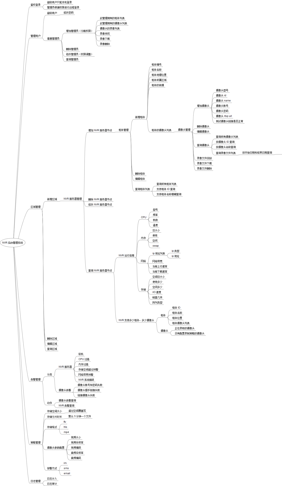

# qiyicc.nvr

    前一段时间，由于有录像文件的云存储以及后台管理功能的需求，在网上搜集了相关部分的信息，发现这方面的资料要么是商业化的，要么是不完整的，
    要么是非常复杂的，于是萌发了一个自己的一个想法。想打算实现一套，分布式，健壮的，可扩容，可维护，可以非常简单的接入任何终端的项目。
    这就是这个项目的由来！

    这是一个 NVR 云项目，支持对前端摄像头的录像文件的云存储，以及后台录像文件的管理，主要是权限分配，增删改查等操作，前端通过 Resetful API 接口，
    获取录像文件信息并展示，通过 html5 终端可以播放。项目刚刚开始，后续会不断的完善，由于项目过于庞大，目前只实现了，录像存储服务器的关键部分，
    后台管理的 web 方面还没有实现，以及前端的展示界面 ( 目前只支持 web ) 也没有实现，因此，如果有兴趣的同学可以私下联系我，共同进行这项非常有意义
    的事情。

    我的联系方式：

    qq： 99766553
    webchat: 99766553
    website: www.qiyicc.com
    e-mail: cwf12345@sina.com || qiyicc@sina.com
    
    
   
